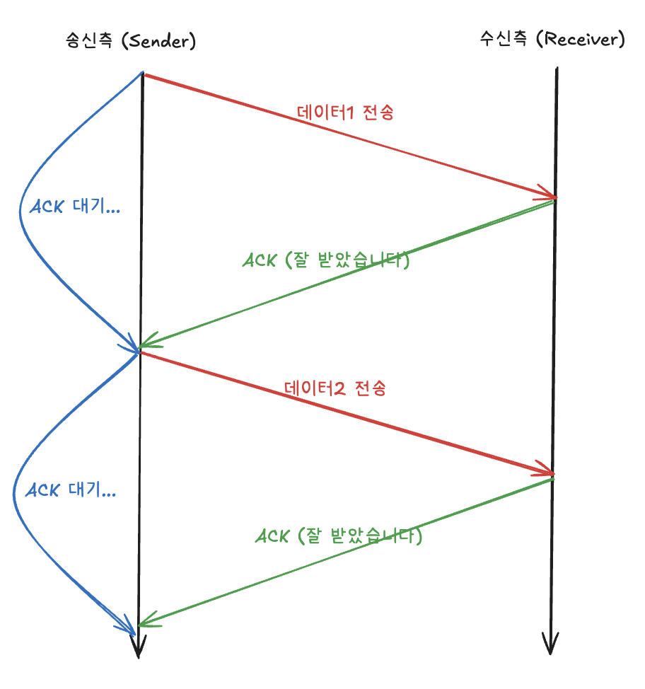
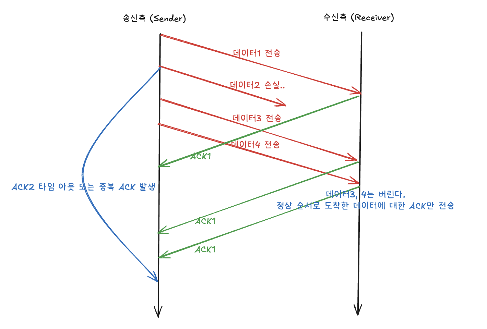
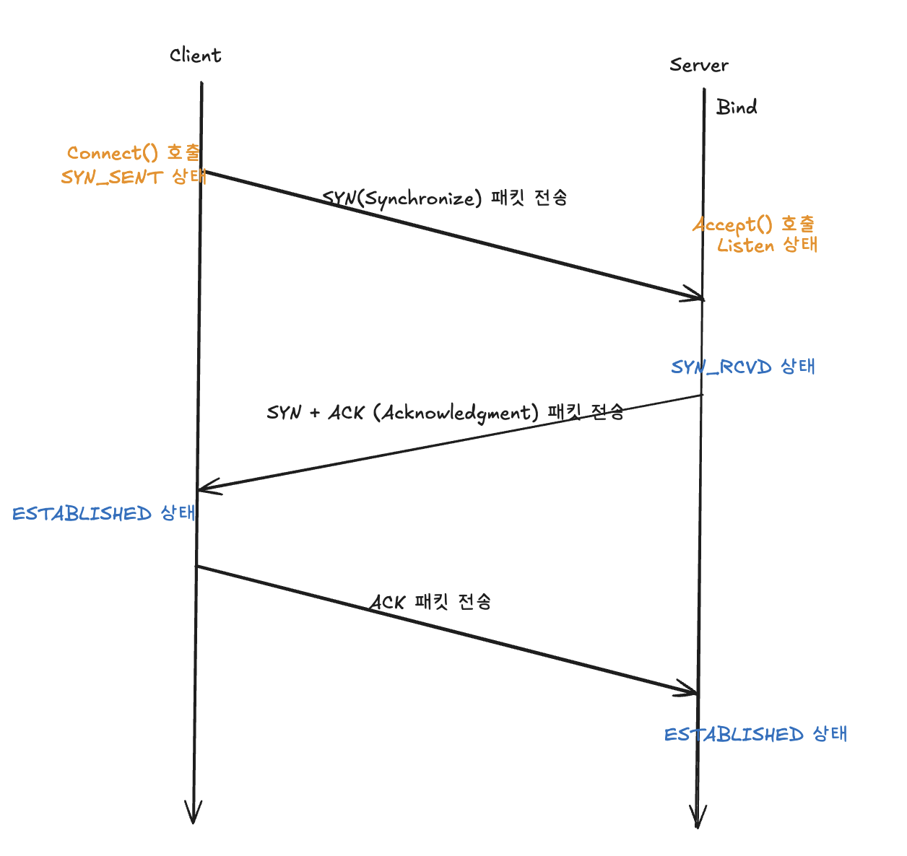

# 들어가며.

소켓 통신을 직접 Java를 통해 구현하며, 4계층의 대한 이해를 하기 위함!

## 소켓 통신

네트워크 상에서 두 프로그램이 데이터를 주고 받기 위하 사용하는 통신 방식이다.

소켓은 **네트워크를 통해 데이터를 송수신할 수 있도록 운영체제가 제공하는 인터페이스**이다. 소켓을 사용하면 **마치 파일을 읽고 쓰듯이** 네트워크를 통해 데이터를 주고 받을 수 있다.

### TCP

두 프로그램 사이에 논리적인 접속을 성립하기 위하여 연결을 설정하여 신뢰성을 보장하는 **연결형 서비스**이다.

데이터 단위는 **세그먼트**(메시지 -> 세그먼트 -> 패킷 -> 프레임)이다.

#### TCP의 특징

1. **연결형 서비스**

연결형 서비스로 가상 회선 방식을 제공한다.

- 3-way handshaking 과정을 통해 연결을 설정.
- 4-way handshaking 과정을 통해 연결을 해제.

2. **흐름 제어(Flow Control)**

데이터 처리 속도를 조절하여 수신자의 버퍼 오버플로우를 방지.

- 송신하는 곳에서 감당이 안되게 많은 데이터를 빠르게 보내 수신하는 곳에서 문제가 일어나는 것을 막는다.
- 수신자가 **윈도우 크기(Window Size) 값을 통해 수신량을 정할 수 있다**.
- 이는 연결 설정 과정(Hand Shake)에서 초기 값을 설정하고, 이후 수신자의 ACK 패킷을 통해 값을 변경할 수 있다.

3. **오류 제어 (Error Control)**

   1. **Stop and Wait ARQ**  
      송신측에서 1개의 프레임을 송신하고 수신 측에서 수신된 프레임의 에러 유무 판단에 따라 ACK 또는 NAK를 보내는 방식이다.

      

      위 그림과 같이 하나의 데이터에 대한 응답을 기다려야 하기 때문에 효율이 떨어진다.

   2. **Go-Back-n ARQ**  
      패킷을 전송할 때, 하나의 패킷을 수신하지 못하면 해당 패킷부터 다시 전송하는 기법이다!

      

      기본적으로 Stop and Wait 방식보단 효율이 좋지만, 패킷 손실이 발생하면 중복된 데이터들을 전송하므로 효율이 떨어질 수 있다.

   3. **Selective-Repeat ARQ**  
      위의 두 방식과는 다르게, 받지못한 데이터만 선택적으로 재전송하는 기법이다.

4. **혼잡제어(Congestion control)**
   송신 측의 데이터 전달과 네트워크 데이터 처리 속도를 해결하기 위한 기법이다. 네트워크 혼잡을 피하기 위해 송신 측에서 보내는 데이터의 전송 속도를 제어하는 것이다.

   - Slow Start.
     패킷이 문제 없이 도착하면 각각의 ACK 패킷마다 Window Size를 늘려가는 방식이다.

#### TCP 소켓 연결 과정

### UDP

비 연결지향형 프로토콜로서, 단순히 특정 프로세스에게 데이터를 전달하는 역할만한다. 데이터 도착의 보장은 하지 않는다.

#### UDP의 특징

1. **단순한 헤더 구조.**
   UDP의 헤더는 총 4가지 필드로 구성되어 있습니다.
   Source Port, Dest Port, Length, Checksum. (총 8바이트)

2. **Checksum 을 통한 에러 검출**
   전송 중 비트가 뒤바뀌거나 손상된 경우, 수신측에서 checksum을 통해 이를 감지할 수 있다.

   오류가 감지되면 해당 데이터그램은 그냥 폐기되고, 재전송은 애플리케이션에게 맡긴다.

   UDP는 '에러 복구'는 하지 않고, **단지 '에러 감지'까지만** 제공한다.

3. **데이터그램 기반 전송**
   각 데이터그램은 완전히 독립적인 전송 단위이다.
   따라서, 손실되거나 순서가 바뀌어도 UDP는 책임지지 않는다. (이는 상위 계층의 몫)

#### 예시

매우 큰 데이터그램 하나를 전송하게 되면, 이는 3계층에서 여러 개의 패킷으로 쪼개지게 된다. 이는 도착지에서 다시 하나의 데이터그램으로 합쳐질 수 있다!!

#### 구현 사진.

